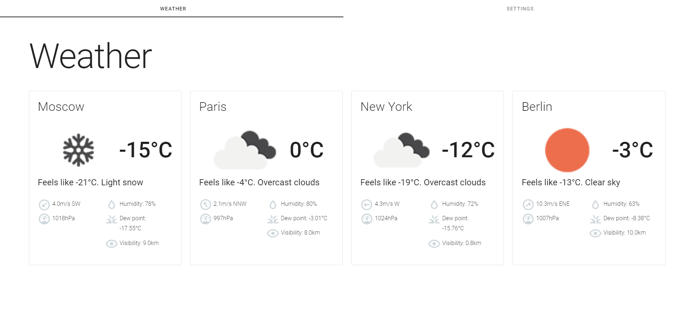

# weather-widget-plumsail-test-project
[](https://www.codacy.com/gh/michaellux/weather-widget-plumsail-test-project/dashboard?utm_source=github.com&amp;utm_medium=referral&amp;utm_content=michaellux/weather-widget-plumsail-test-project&amp;utm_campaign=Badge_Grade)
## Task
Implement a widget that displays the weather in the specified cities. 
Technologies: Vue JS, Typescript/ES7 and Babel, SCSS, Webpack. 
Conditions: 
1. Users should be able to add this widget to their websites as simple as inserting the snippet into 
an HTML-page: 
```
<weather-widget /> 
<script type="text/javascript" url="{URL to the app}"></script> 
```


2. Get data for the widget from free public API. You must register an account at OpenWeather.
3. After clicking the ‘Gear’ button at the upper-right corner, switch the view to the following: 
Here, a user must be able to:

a. Remove previously added cities. 

b. Reorder the cities by dragging and dropping them within the list using ‘Hamburger’ icon 
to the left from the city name. 

c. Add new locations.

4. Save the configuration in the local storage and restore it on future visits. A user should be able 
to configure the widget just once and then have the same view until they change the computer 
or clean the storage. 
5. By default, on initial opening, request the current user’s location and display the weather in 
their city. 
**Important:** UI of your app may differ. You can use any CSS frameworks and UI libraries. We evaluate the 
quality of your code and UI/UX. The app is quite basic but consider it as a real-life application that is 
going to be supported and intensively improved by a team.

## Solution

### Project setup
npm install
### Build project
npm run build
### Launch project
npm run serve
